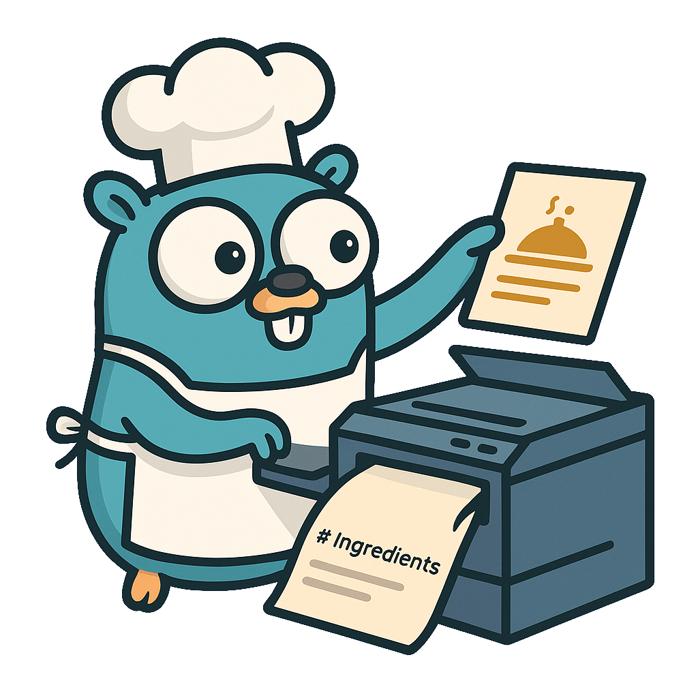

[](https://github.com/gKits/gorecipe.md/releases)

<div align="center">
  <a href="https://github.com/gkits/gorecipe.md">

  </a>
  <h1 align="center">gorecipe.md</h1>
  <p align="center">
    Scrape your favorie recipes and convert them to markdown
  </p>
</div>

`gorecipe.md` is a small cli tool that scrapes a recipe from the web and converts it to a markdown
file. I initially programmed this tool to be able to save my favorite recipes and add them to a
markdown notebook or to my own blog build by a static site generator like
[Hugo](https://github.com/gohugoio/hugo) or [Zola](https://github.com/getzola/zola).

This tool also supports the usage of custom templates using the
[`text/template`](https://pkg.go.dev/text/template) syntax meaning you can also convert the scraped
recipes to any format you like. To learn more about custom templates see the
[Custom Template](#custom-template) section.

## Getting started

### Installation

#### Go (recommended)

To install `gorecipe.md` with go run:

```sh
go install github.com/gkits/gorecipe.md@latest
```

#### From source

To install `gorecipe.md` from the source follow these steps.

1. Clone this repository

```sh
git clone --depth 1 https://github.com/gkits/gorecipe.md
```

2. Move into the newly cloned repository

```sh
cd gorecipe.md
```

3. Build and install the binary

```sh
go build && go install
```

4. Add your go install path to your `$PATH`

```sh
export PATH=$PATH:$HOME/go/bin
```

By default go installs the binary of your local user to `$HOME/go/bin` if you have changed this
default behavior adjust accordingly.

### Usage

#### Examples

##### Print recipe to stdout

```sh
gorecipe.md https://www.noracooks.com/vegan-pancakes
```

##### Write recipe to file

```sh
gorecipe.md -o pancakes.md https://www.noracooks.com/vegan-pancakes
```

#### Options

```
-f, --force         force markdown by ignoring missing recipe parts
-h, --help          help for gorecipe.md
    --hugo          add hugo headers
-o, --out string    path to output file
    --tmpl string   custom markdown template
-v, --version       version for gorecipe.md
```

#### Custom Template

By using the `--tmpl` flag when running `gorecipe.md` you can provide a custom template. For
reference follow the documentation of [`text/template`](https://pkg.go.dev/text/template) of go's
standard library.

When writing your own template you can use the following snippets:

- `{{.Title}}` (`string`): name of the recipe
- `{{.Description}}` (`string`): recipe description
- `{{.Ingredients}}` (`[]string`): list of ingredients
- `{{.Instructions}}` (`[]string`): list of instructions

Here is an example of a template that converts the scraped recipe to `json`:

```sh
gorecipe.md https://www.noracooks.com/vegan-pancakes --tmpl \
'{
  "title": "{{.Title}}",
  "description": "{{.Description}}",
  "ingredients": [ {{range $i, $el := .Ingredients}}{{if $i}}, {{end}}"{{$el}}"{{end}} ],
  "instructions": [ {{range $i, $el := .Instructions}}{{if $i}}, {{end}}"{{$el}}"{{end}} ]
}
'
```

Alternatively you can save your template to a file and substitude it into the command using the
following:

```sh
gorecipe.md https://www.noracooks.com/vegan-pancakes --tmpl "$(cat json-recipe.tmpl)"
```
